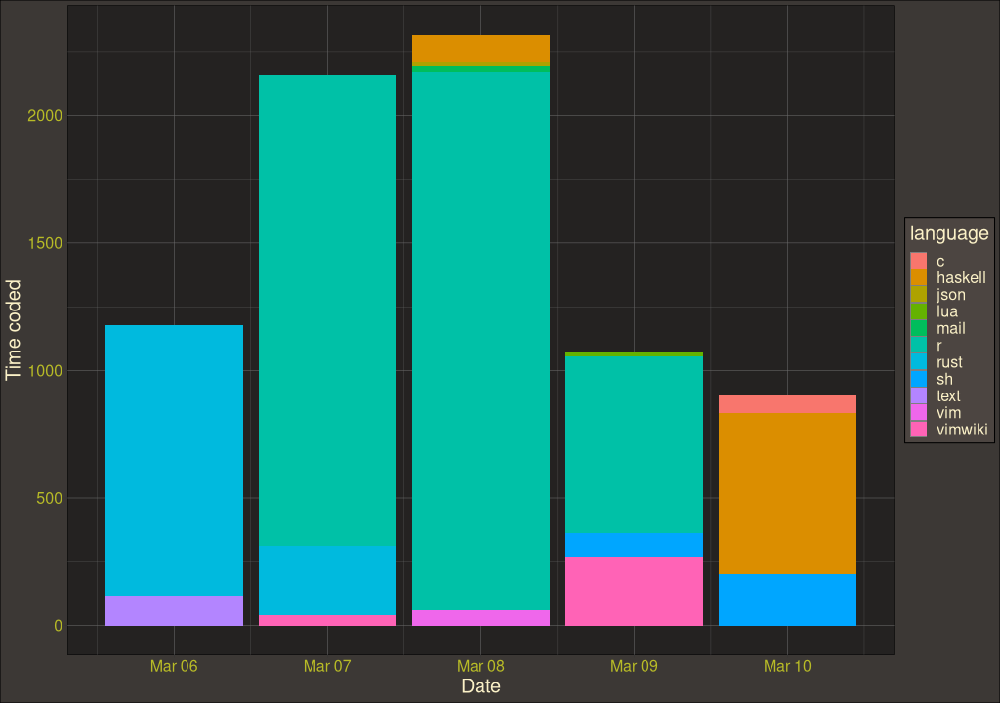
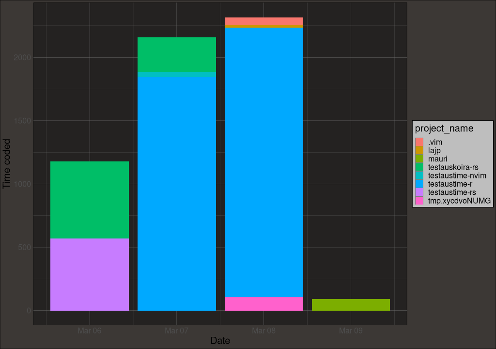

# testaustime-r

Visualize your testaustime data with cool graphs generated with an R script using ggplot2

## How to use?
1. Install necessary packages (and R if you dont have it):
    ```R
    install.packages("httr", "rjson", "ggplot2", "ggthemes")
    ```
2. Run the script (first insert your token into it):
    ```sh
    Rscript plot.R
    ```
3. Look at cool images

## How does it look?
(please ignore the awful colorscheme, I'm working on it (not))


